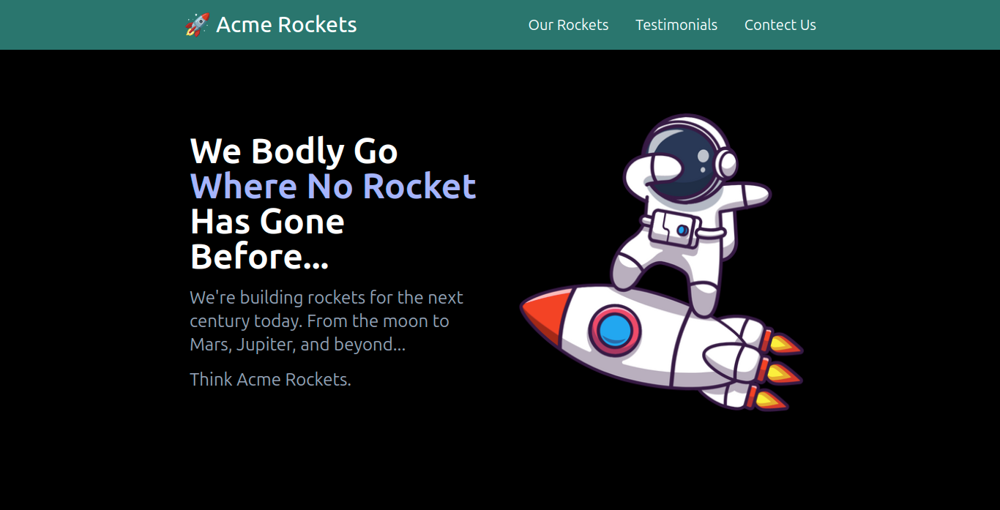

# Acme Rockets 🚀

Welcome to **Acme Rockets**! 🌟 This project showcases a modern and responsive UI using Tailwind CSS, designed to be both stylish and functional. Perfect for building sleek web interfaces with ease!

## 🚀 Features

- **Responsive Design**: Adapts to various screen sizes with Tailwind’s responsive utilities 📱💻
- **Modern UI Elements**: Utilizes Tailwind CSS for a clean and contemporary look 🎨
- **Custom Animations**: Includes custom animations and utilities for dynamic effects 🎢
- **Easy Integration**: Simple setup and integration with Tailwind CSS for rapid development ⚙️

## 📸 Screenshots

Here’s a sneak peek of what you’ll get:

- **Hero Section**:

  

## 🚀 Getting Started

To get started with **Acme Rockets**, follow these steps:

1. **Clone the Repository**:

   ```bash
   git clone https://github.com/AnasHany2193/acme-rockets.git
   cd acme-rockets
   ```

2. **Install Dependencies**:

   ```bash
   npm install
   ```

3. **Run Tailwind CSS**:

   Build your styles with Tailwind CSS:

   ```bash
   npm run tailwind
   ```

4. **Format Code**:

   Ensure code consistency with Prettier:

   ```bash
   npm run prettier
   ```

## 🛠️ Tools and Technologies

- **Tailwind CSS**: A utility-first CSS framework for rapid UI development ⚡
- **Prettier**: Code formatter for maintaining consistent code style ✨
- **Node.js**: JavaScript runtime for running build scripts 🛠️

## ✨ Contributing

Contributions are welcome! If you’d like to help improve **Acme Rockets**, feel free to:

- Open an issue to report bugs or suggest features 🐛
- Submit a pull request with your improvements or fixes 🔧

## Live Demo

Check out the live demo [here](https://acme-rockets-2193.netlify.app/)! 🚀

## 💬 Contact

For any questions or suggestions, you can reach out to me:

- **LinkedIn**: [Anas Hany](https://www.linkedin.com/in/anashany219/)
- **GitHub**: [AnasHany2193](https://github.com/AnasHany2193)

Happy coding! 🚀✨
